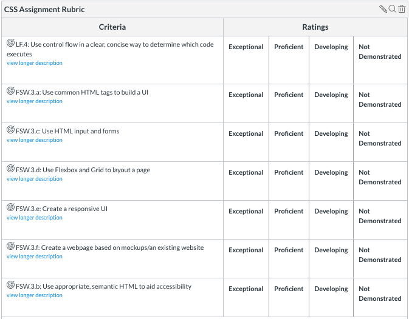

# Unit 2 Assignment: CSS

Your task is to recreate the homepage of [Twitter](https://twitter.com/?lang=en) using only HTML and CSS.


## Project Requirements

Three sections:
White, Blue, Footer

White Section:
* Should have logo and Login Button.
* Headers / Welcoming
* Sign Up and Log in In Buttons.
* All buttons should have appropriate hover effects.

Blue Section:
* Blue image background.
* Main advertisement line.
* Three li's in ul with font awesome images.
* Tooltip title of bird.

Footer Section:
* ul with lis. Lis contain a tags.
* Should wrap, be centerd, correct colors / size.
* Hover effect should underline. But not on copyright.

Page should have correct title and favicon.  The UI should be responsive.

## Rubric



## Scaffold

### Create the HTML skeleton

Begin by creating the initial skeleton of your html.

It should have an html tag, a head tag, title, and empty body.

```HTML
<!DOCTYPE html>
<html lang="en" dir="ltr">
  <head>
    <meta charset="utf-8">
    <title></title>
  </head>
  <body>

  </body>
</html>
```

Add a title to the page that matches the homepage.

Follow this [link](https://www.favicon.cc/?action=icon&file_id=802027) and add the favicon in the appropriate location.

Your next task is get all the elements onto the page. Don't worry about any styling for now.

You can find links to images that may be helpful in the `images` directory

### Scope out how to divide the page

Start with thinking how you could break the page into boxes. I see two sections in the middle (a white and a blue), and a footer at the bottom.

Inside the blue I see a ul with three li's. Use [Font Awesome](https://fontawesome.com/start) to find the right icons.

Inside the white a see a form box at the top and then another box with the other information.

In the footer I see another unordered list made up of link tags.

Pay attention to details. Does a tooltip pop up when you hover over the blue section? (It did when I started the project, think HTML title)

### Test out responsiveness

Once you've got all the html elements on the page, play with the size of the screen and take note of the changes. Should anything be added? If elements appear / disappear make sure that for now all elements are appearing. Once we start styling we can make display changes based on screen size with media queries.

### Create the CSS file

Next create a css file. For today, we'll do all of our styling in one file, but please note that for bigger projects this is not the ideal practice. Think about styles that certain elements can share with classes. Do NOT give every single element a unique ID and then style each element separately. Find the styles in common and give them a class.

You've probably noticed that your browser has already assigned some default styles to your elements. An easy example of this to spot is the * before each li. This is not something that we want. We want to retain 100% control of every style that takes place on our page.

At the top of your css file add a [CSS Reset](https://cssreset.com/scripts/eric-meyer-reset-css/). This will remove all those pesky unwanted styles.

When you begin to style it's best to take a mobile first approach. Set twitters home screen to be as small as possible and set your screen to match (if you're truly doing mobile first you should set the view in your inspect to be the smallest screen possible, but for now lets just do the smallest possible size on desktop) Then begin styling.

### Make the UI responsive

After you've completed your replica at the smaller screen, slowly expand Twitter's screen and identify the breakpoints. These are the points where things move, appear / disappear, or change in size. Style for each breakpoint at the bottom of your css file to have a fully responsive site.
